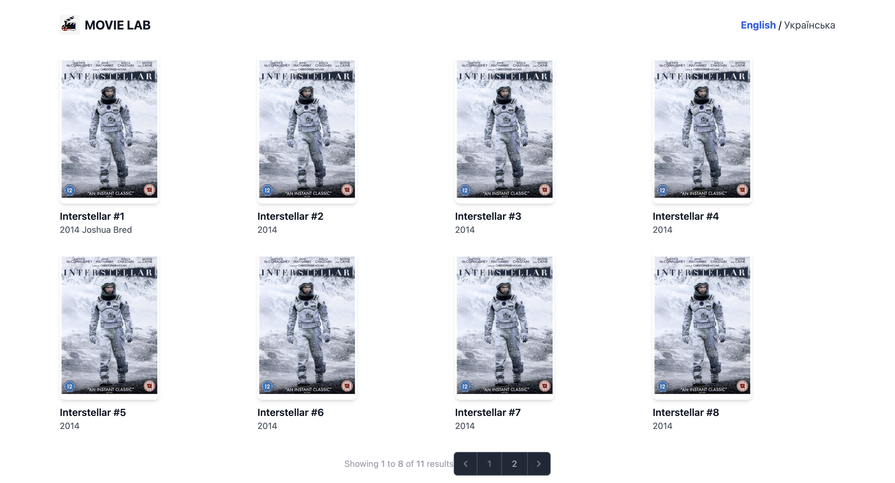
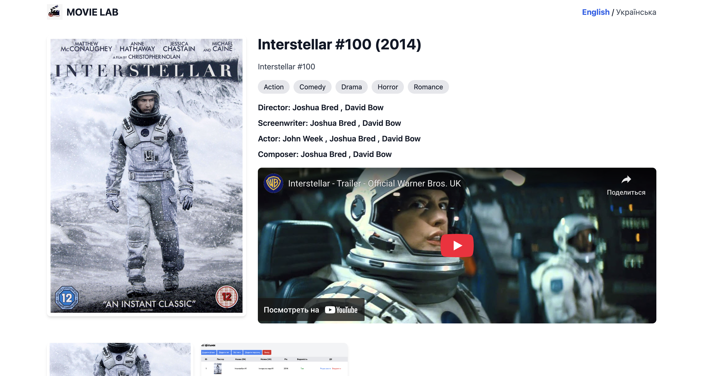
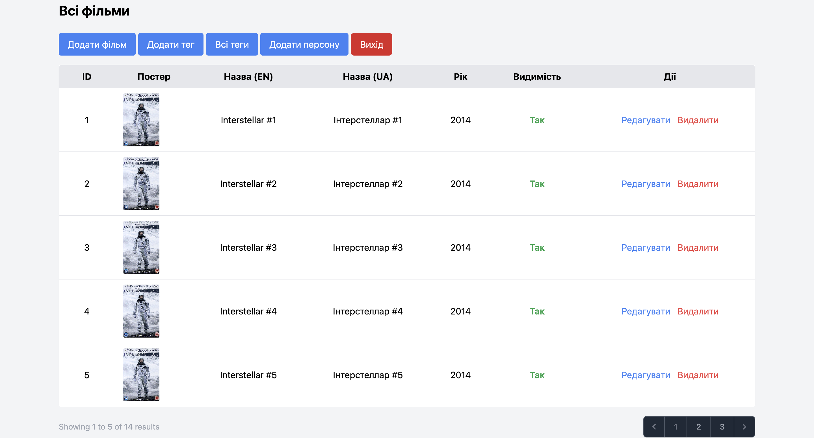

# Movie Lab

Movie Lab — це веб-додаток для каталогу фільмів з підтримкою кількох мов, трейлерів та ролей персонажів. Також реалізована можливість підписки на телеграм бота для отримання повідомлення, коли зявляється новий фільм на сайті. 

---

## Скриншоти

Frontend частина зроблена для демонстрації роботи backend.  

---

## Встановлення

1. Клонувати репозиторій:

    git clone https://github.com/david-yaromenko/movie_lab

2. Перейти в папку проекту:  

    cd task

3. Встановити залежності:  

    composer install. 
    npm install. 
    npm run dev. 

4. Створити .env та згенерувати ключ додатку:  

    cp .env.example  
    php artisan key:generate. 

5. Міграції та сіди:  

    php artisan migrate --seed. 

6. Запуск локального сервера. 

    docker-compose up -d.  
    php artisan serve.  
    npm run dev.  
    php artisan queue:work.  
    php artisan command: bot:poll.  

    Проєкт буде доступний за адресою: http://localhost:8000. 

## Використання: 

localhost:8000/ - клієнтська частина для перегляду всіх фільмів.  
Клік на фільм відкриває сторінку з детальною інформацією.  
Клік по посиланню на телеграм бота відкриває нову вкладку з можливістю підписки.  

localhost:8000/admin/login - логін для адміністратора.  
Дані для входу створені за допомгою seeder:  

email: admin@ex.com   
password: password. 

Головна сторінка адмінськоі панелі - localhost:8000/admin/movies.  

## Особливості:

Мультимовна підтримка (Laravel Localization). 

Трейлери YouTube з обмеженням за датою. 

Ролі персонажів (режисер, актор, композитор тощо). 

Можливість приховувати фільми, щоб при переході на сторінку видавався 404. 

Скриншоти та постери фільмів, теги, slug, пагінація.  

Підписка на телеграм бота.
